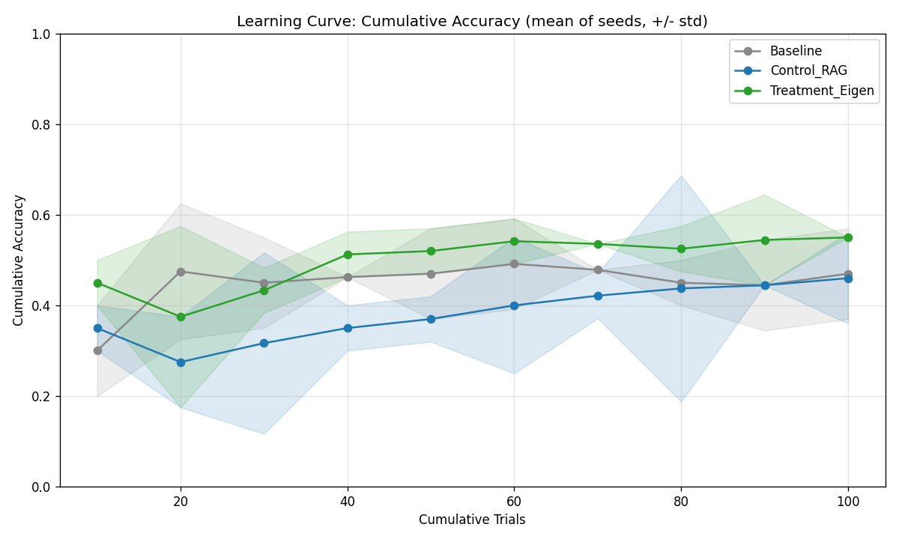
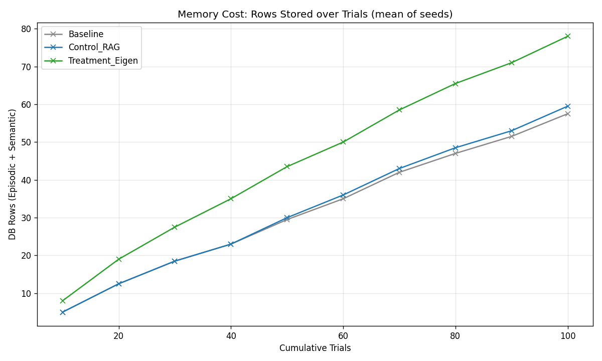

# Findings

> Honest write-up of what the experiment actually showed. Results are the mean of
> **2 seeds** (42, 7), 100 trials each, on a local `gemma3:4b` model.

## TL;DR

I built a surprise-gated "eigen-memory" agent, made the mechanism genuinely work (fixing
bugs that had silently turned the surprise signal into a constant), ran a controlled
multi-seed experiment — and found that the **three arms are statistically indistinguishable**.
Eigen-memory shows a faint hint of higher cumulative accuracy (0.55 vs ~0.46), but the error
bands overlap completely, so it is not a defensible win. The more important finding is *why the
task can't show a difference even in principle*: the embedding substrate is blind to the
(arithmetic) rule, the task rewards memorization over generalization, and the effect is below
the noise floor. The deliverable is a rigorous post-mortem, not a win.

## Results (mean of 2 seeds, 100 trials each)

| Arm | Final-batch accuracy | Cumulative accuracy (all 100 trials) |
|-----|----------------------|--------------------------------------|
| Baseline (no memory) | 0.70 | 0.47 |
| Control_RAG (retrieval) | 0.60 | 0.46 |
| Treatment_Eigen (retrieval + axioms) | 0.60 | **0.55** |

**Read the error bands, not the lines.** Treatment_Eigen's cumulative accuracy (0.55) edges out
RAG (0.46) and Baseline (0.47) by ~9 points — but the ±1 std bands of all three arms **overlap
almost completely**, and on the noisier final-batch metric Baseline is *highest*. With only 2
seeds and per-batch swings of 0.30–0.75, **the three arms are statistically indistinguishable.**
There is a *hint* that Eigen accumulated more correct answers, but it is not a defensible win —
and, as the next section argues, even a clean win here would be uninterpretable.

## What I had to fix before the experiment was even valid

The most important part of this project is *not* the architecture — it's that the original
experiment was measuring nothing. Three separate bugs each made the "surprise" signal a
**constant**, so memory was being gated on noise:

1. **Flat 2.0** — an `UnboundLocalError` when the true-label token was missing from the
   logprobs was silently caught and replaced with a hardcoded `2.0`. Every recorded surprise
   score was exactly `2.00`.
2. **Flat 7.0** — after fixing (1), a completion-style probe prompt (`"...the label:"`) was
   fed to a *chat* model, which replies with prose. The label was never the first token, so
   surprise collapsed to the missing-token fallback (`7.0`) for every item.
3. Fixed by constraining the probe to emit exactly one label word, so its logprob is a real,
   varied prediction-error signal (`1.55, 4.62, 5.45, ...`).

**Lesson:** a sophisticated-looking pipeline can produce authoritative numbers while
measuring a constant. The only way I caught it was instrumenting and *looking at the actual
surprise values*, not just the final accuracy. This is the engineering-judgment story.

## The result, honestly

No arm clearly learns the rule. Cumulative accuracy lands at ~0.47 (Baseline), ~0.46 (RAG), and
~0.55 (Eigen) — all hovering not far above the ~0.33 three-class chance line, none climbing
toward mastery. RAG barely improved on no-memory at all, which is itself a signal: retrieval
added almost nothing because the retrieved neighbors are not actually informative for an
arithmetic rule. Eigen's slight edge is within noise and rests on 2 seeds; I would not claim it
as real without the more powered experiment in [docs/VALID_EXPERIMENT.md](docs/VALID_EXPERIMENT.md).

### The agent talked itself into giving up — and that *is* the finding

The single most revealing artifact of the whole project is an axiom the agent crystallized about
its own failures:

> **RULE:** The model must always output one of the specified colors (RED, BLUE, or GREEN)
> without any interpretation or analysis of the input number. **It should simply pick one at
> random.**

Its reasoning (paraphrased from the `<thought>` block): the failure cases are the ones where the
model *tried to reason* about the number (primes, mappings, codes); the success cases are where
it just picked a color. So it concluded the optimal policy is to **stop reasoning and guess**.

On this task that conclusion is *locally correct* — because the embedding substrate hides the
rule, reasoning genuinely doesn't pay off, so the "overthinking" runs do worse by chance. The
agent correctly induced that **there is no learnable signal it can act on**, and rationalized
surrender. That is the embedding-substrate problem, narrated from inside the agent.

### Axiom quality is real but uneven

Across the run the kernel crystallized ~15–20 axioms per Treatment phase. Inspecting them:
some genuinely name the rule concepts (`prime`, `divisible`, `5`); others are mostly preamble
("Here's my analysis:") or, as above, advise guessing. So crystallization *can* surface the
right structure, but injection is noisy and unvalidated — a wrong or defeatist axiom poisons the
context. Validating axioms before injection is listed in next steps.

### Memory cost

Eigen stores strictly more than RAG — every episode RAG keeps, **plus** the crystallized axioms
(~15–20 per run) and their eigenvectors. So Eigen pays a higher memory and token cost for, here,
no reliable accuracy gain — the worst quadrant of the cost/benefit plane on this task.

## The real finding: the experiment cannot answer the question it asks

The most valuable result of this project is a **critique of its own experimental design**.
After making the mechanism actually work, I asked the harder question — *can this task even
demonstrate the hypothesis?* — and the answer is no. Three design flaws each independently
undermine the test:

### 1. The embedding substrate cannot represent the rule

The hidden rule is *arithmetic*: `prime → RED`, `÷5 → BLUE`, `else → GREEN`. But the agent
embeds a bare integer (e.g. `47`) with a **text** embedding model, then retrieves by cosine
similarity and runs PCA over those vectors. Text embeddings of number-tokens do **not** cluster
by primality or divisibility — `47` and `53` (both prime) are not necessarily close; `47` and
`48` (RED vs GREEN) may be closer.

So the retrieval substrate **cannot express the rule**. Neither RAG nor Eigen-memory can exploit
similarity that doesn't encode the relevant property. A null result is therefore uninterpretable:
it can't distinguish "eigen-memory is bad" from "the representation is blind to the rule."

### 2. The task rewards memorization, not generalization — which structurally favors RAG

Inputs are integers 1–100 with a fixed rule, run for 100 trials. By the end the agent has seen
**most of the input space**. Plain episodic RAG only needs to have stored the *exact* number
before — it never needs a rule. But the entire point of crystallizing an axiom ("primes are RED")
is to **generalize to unseen inputs**, and this task has almost none. The design gives the
rule-compression mechanism nothing to win with, and hands the win to lookup.

A valid test requires a **train/test split**: induce the rule on some inputs, then evaluate on
**held-out** inputs the agent has never stored. That is the only setting where "compress into a
generalizable rule" can beat "look up the nearest past episode."

### 3. The effect size is below the noise floor

A single 100-trial run is very noisy — batch accuracy swings from 20% to 90%, and two separate
"before" runs disagreed (Eigen 0.5 vs 0.9 final). Averaging seeds (done here) helps, but the
effect being hunted is plausibly smaller than seed-to-seed variance with one small 4B model.

### What a valid experiment would require

- A task whose similarity structure lives in **embedding space** (e.g. a hidden *semantic* rule
  over short texts), so retrieval can actually see the signal.
- A **train/test split** so generalization — not memorization — is what's measured.
- Enough seeds (and ideally a paired significance test) to clear the noise floor.

I deliberately did **not** rebuild the task — the critique itself is the result. Knowing *why*
an experiment can't answer its question, and what the valid version looks like, is the point.
The full design of the experiment that *could* validate this approach — a hidden semantic rule
over short texts, a held-out test phase with frozen memory, an equal-token-budget control arm,
and a pre-registered decision rule — is written up in
[docs/VALID_EXPERIMENT.md](docs/VALID_EXPERIMENT.md).

## How this sits in the literature

This architecture recombines three well-established ideas (see [docs/PRIOR_ART.md](docs/PRIOR_ART.md)):

- **Surprise-gated storage** ← Prioritized Experience Replay (Schaul 2015), curiosity as
  prediction error (Pathak 2017).
- **Consolidating experience into natural-language rules** ← Generative Agents reflection
  (Park 2023), Reflexion (Shinn 2023), ExpeL insights (Zhao 2023).
- **PCA over representations to extract directions** ← Representation Engineering (Zou 2023).

"Eigen-memory" is this project's own coinage, not an established method. And the field-wide
pattern is that elaborate agent-memory schemes often only modestly beat a well-tuned RAG
baseline — consistent with what I see here.

## What I'd do next

- **Fix the substrate**: a task where embedding similarity actually encodes the rule, or embed
  engineered numeric features instead of raw text.
- **More seeds + a paired significance test** for a statistically powered claim.
- **Validate axiom quality before injection** — a wrong self-written rule poisons the context;
  measure how often crystallized axioms are actually correct.
- **Ablate the two surprise signals** (entropy vs NLL) to see which, if either, is load-bearing.
