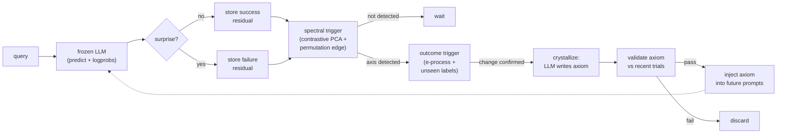

# Eigen-Memory: compressing an agent's surprises into rules instead of weights

An inference-time memory layer for frozen LLMs that detects when the model's errors
have structure, compresses that structure into a short English rule, and injects it
into future prompts. No fine-tuning, no gradient access — just a wrapper that watches
what the model gets wrong and writes itself instructions.



Everything runs **locally**: `gemma3:4b` / `gemma4:12b` + `embeddinggemma` via Ollama,
Postgres + `pgvector`. No API keys, no cloud.

---

## What it demonstrates

This project is a research prototype built from scratch — original theory, controlled
experiments, and honest evaluation on a problem with no known solution. It shows:

- **Research engineering.** A two-file core (`agent.py` + `memory_kernel.py`, ~1500 lines)
  that implements contrastive PCA over retrieval residuals, permutation-calibrated gating,
  e-process change detection, and axiom lifecycle management. 68 tests, including an
  [executable theory](tests/test_kernel_theory.py) where every mathematical claim runs as
  a test case.

- **Experiment design.** Four controlled experiments against a RAG baseline, each with
  pre-registered hypotheses, guardrail checks that gate expensive runs, and every result
  number traced to a committed JSON artifact.

- **Diagnosis under uncertainty.** A pre-registered experiment that missed its bar (+0.078
  vs +0.10), an autopsy that identified four specific defects, and a rebuild that cleared
  +0.242 on the same seeds — documented as it happened, including the caveats that make
  the positive result weaker than it looks.

---

## The idea

Titans ([Behrouz et al. 2024](https://arxiv.org/abs/2501.00663)) showed that a memory
which decides what to keep by measuring its own surprise can beat attention at scale.
Titans compresses into neural weights inside an architecture you pretrain from scratch.
This project takes the same idea — *surprise decides what survives* — and asks whether
it works as a pure inference-time wrapper around a model you can't touch. Compress into
sentences instead of weights, and you get something auditable, portable, and cheap.

Three moving parts:

- **Surprise** is read from the model's own logits — entropy and NLL of the true label —
  a black-box analogue of Titans' gradient signal. Measured *with memory in context*, so
  already-solved items stop registering.
- **Detection** watches the residuals (query embedding minus retrieved-neighbor embedding)
  and fires when failures line up along a direction that clears a permutation-estimated
  noise edge. A separate outcome trigger catches rule-shifts from the correctness stream.
- **Crystallization** compresses that cluster into one English rule — an **axiom** —
  validated against recent trials before storage, retired if it stops earning its place.

The comparison throughout is against plain **RAG** — retrieving the most similar past
examples — because that is what you would actually build instead.

---

## Results

Four experiments, each designed to test a different failure mode.

| # | Experiment | What it tested | Outcome |
|---|------------|---------------|---------|
| 1 | **Number-game** | hidden arithmetic rule (embedding-invisible) | tie — no memory can help when embeddings can't encode the rule |
| 2 | **TREC** | question-type classification (embedding-visible) | RAG wins — one retrieved example already saturates |
| 3 | **Label-flip** | purpose-built polarity task, 4 seeds | tie — the 4B model follows a pasted rule worse than it copies a neighbor |
| 4 | **Rule-Shift** | rule flips mid-run, 12B model, 5 seeds | **+0.242 in-sample** after rebuild (pre-registered run scored +0.078 vs +0.10 bar) |

**What works.** When the underlying rule changes mid-stream — the scenario retrieval
can't handle — the rebuilt outcome-stream detector catches the shift (5/5 seeds), writes
a correct rule where it fires (3/5 seeds), and scores 1.000 accuracy on the class the rule-shift redefines.
The two non-firing seeds wrote nothing rather than something wrong — the detector correctly waited for
evidence that never arrived within the trial window. Zero false fires across all four
experiments.

**Where it doesn't help.** On static tasks, retrieval is already optimal. The gate
correctly stays shut: zero false positives on tasks with no learnable spectral signal.
Each experiment's negative result has a specific, diagnosable cause documented in
[docs/FINDINGS.md](docs/FINDINGS.md).

**The caveat.** The +0.242 result is in-sample — the v4 pipeline was iteratively debugged
on the same five seeds it reports on. The pre-registered pipeline scored +0.078.
Generalization requires held-out seeds or a second task.

---

## How it got there

The path from idea to result was not smooth, and the documentation preserves that path
because the diagnostic work is the interesting part.

The pre-registered pipeline missed. The autopsy found four defects — the largest was
that detection was watching a 768-dimensional contrast statistic with no margin, while
the agent's own correctness stream carried the same signal at far higher strength. An
ungated ablation proved the signal was present: forced to crystallize, all four shut seeds
wrote correct rules. The detector just couldn't surface it.

The rebuild moved detection to the correctness stream, dropped pre-change records from
the contrast window, added axiom validation, and introduced retirement for stale rules.
Five bugs were found along the way — two made "surprise" a constant, one flattened it for
2 of 3 classes, two injected raw chain-of-thought into the arm under test. A theory
review disproved the project's original mechanism and replaced it with one where
[every claim is an executable test](tests/test_kernel_theory.py).

Full narrative: **[docs/BLOG_POST.md](docs/BLOG_POST.md)**.
Full experiment ledger: **[docs/NEXT_EXPERIMENT.md](docs/NEXT_EXPERIMENT.md)**.

---

## Run it yourself

**Prerequisites:** Docker, [Ollama](https://ollama.com) (`localhost:11434`),
[uv](https://docs.astral.sh/uv/).

```bash
# Models (local, ~3-4 GB; gemma4 only needed for Rule-Shift)
ollama pull gemma3:4b
ollama pull embeddinggemma
ollama pull gemma4:12b          # ~8 GB, skip for experiments 1-3

# Stack
cp .env.example .env            # defaults work out of the box
docker compose up -d
docker exec -i memory-db psql -U postgres -d memory_agent < schema.sql
uv sync

# Experiments
uv run python simulate.py                    # number-game
TASK=trec uv run python simulate.py          # TREC
uv run python run_flip_experiment.py 42      # label-flip (4 arms)
uv run python run_shift_experiment.py 42     # Rule-Shift (~6h/seed on consumer GPU)

# Tests — includes the executable theory
uv run pytest
```

---

## Going deeper

| Document | What it covers |
|----------|----------------|
| [docs/BLOG_POST.md](docs/BLOG_POST.md) | Full narrative — Titans lineage, the corrected compressor, the executor gate |
| [docs/NEXT_EXPERIMENT.md](docs/NEXT_EXPERIMENT.md) | Pre-registration, the static-task paradox, Rule-Shift design, five-seed verdict, open roadmap |
| [docs/THEORY.md](docs/THEORY.md) | The corrected mechanism — contrastive PCA, detectability-gated trigger; every claim executable |
| [docs/FINDINGS.md](docs/FINDINGS.md) | Number-game and TREC results, constant-surprise bug archaeology |
| [docs/PRIOR_ART.md](docs/PRIOR_ART.md) | Literature placement — Titans, RepE, cPCA, BBP, the verbal-consolidation line |

---

## Repository layout

```
src/eigen_memory_agent/
  agent.py                      # the agent loop: predict, measure surprise, learn
  memory_kernel.py              # contrastive residual PCA -> gated axiom crystallization

simulate.py                     # number-game / TREC experiment
run_flip_experiment.py          # 4-arm label-flip experiment
run_shift_experiment.py         # 5-arm Rule-Shift experiment (incl. recency kill arm)

tests/                          # 68 tests, including the executable theory
scripts/analysis/               # gate calibration, guardrails, ablations, plotting
results/                        # every number in the docs traces to a committed artifact
docs/                           # theory, task design, prior art, blog post
```

## License

[MIT](LICENSE). Datasets are downloaded at runtime — see [docs/DATASETS.md](docs/DATASETS.md).
