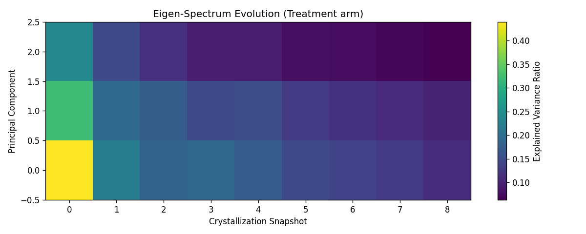

# Eigen-Memory Agent

**An LLM agent that learns hidden rules from its own mistakes — and a controlled experiment testing whether a novel "eigen-memory" beats plain retrieval.**

The agent plays a game: classify a number as `RED`, `BLUE`, or `GREEN`. It is never told the
rule (`prime → RED`, `divisible by 5 → BLUE`, `else → GREEN`). It only gets *correct / incorrect*
feedback, and must induce the rule by remembering and reflecting on what surprised it.

It runs entirely **locally** — a 4B-parameter model (`gemma3:4b`) via Ollama, with a
Postgres + `pgvector` memory store. No API keys, no cloud.

---

## The idea: surprise-gated, self-consolidating memory

The agent has a three-tier memory inspired by how brains consolidate experience:

| Tier | Table | What it holds |
|------|-------|---------------|
| **Episodic buffer** | `episodic_buffer` | Raw experiences, written only when *surprising* (high prediction error) or *salient* (high token entropy). |
| **Semantic core** | `semantic_core` | Compressed "axioms" — natural-language rules the agent writes about its own failure patterns. |
| **Eigen kernel** | (in-memory PCA) | Incremental PCA over surprise vectors. When a principal direction stabilizes, the agent introspects on the failures along it and crystallizes an axiom. |

Two signals gate what gets remembered, both read from the model's own logits:

- **Perceptual surprise** — entropy of the next-token distribution (the model is *unsure*).
- **Predictive surprise** — negative log-likelihood of the *true* label (the model was *wrong*).

The headline question: does compressing failures into eigen-axioms (**Treatment**) help the
agent learn faster than plain retrieval of similar past episodes (**Control / RAG**)?

---

## The experiment

Three arms, each run over multiple seeds and averaged:

| Arm | Retrieval | Eigen-memory | What it tests |
|-----|-----------|--------------|---------------|
| **Baseline** | off | off | Can a 4B model do this with no memory at all? |
| **Control_RAG** | on | off | Plain retrieval of top-k similar past episodes. |
| **Treatment_Eigen** | on | on | RAG **plus** crystallized eigen-axioms. |

### Result — a rigorous negative result

The honest headline: **eigen-memory does not clearly beat plain RAG on this task** — and the
more interesting finding is *why the task can't show a difference even in principle*. Getting
the mechanism to genuinely work meant fixing bugs that had quietly turned the "surprise" signal
into a **constant**, so the original experiment was measuring nothing. Once it worked, the task
design itself turned out to be the real flaw: the embedding substrate is blind to the
(arithmetic) rule, and the task rewards memorization over generalization.

This repo is therefore a **post-mortem of an idea**, not a victory lap — which is the point.
Full analysis, including what a valid experiment would require, in **[FINDINGS.md](FINDINGS.md)**.

Cumulative accuracy over 100 trials, mean of 2 seeds: Baseline **0.47**, RAG **0.46**,
Eigen **0.55**. Eigen edges ahead — but the ±std bands overlap almost completely, so the three
arms are **statistically indistinguishable**. Notice in the plot how little RAG improves on
no-memory: retrieval barely helps because the neighbors it finds aren't informative for an
*arithmetic* rule embedded in *text* space.


**A real axiom the agent crystallized about its own failures** — it concluded that the winning
move is to *stop reasoning and guess*, which is locally correct precisely because the substrate
hides the rule:

> **RULE:** The model must always output one of the specified colors (RED, BLUE, or GREEN)
> without any interpretation or analysis of the input number. It should simply pick one at random.

<details>
<summary>Eigen-spectrum evolution (supplementary)</summary>



How the explained variance of the top principal components of the surprise-vector space
evolves as the agent accumulates failures.
</details>

---

## Run it yourself

**Prerequisites:** Docker, [Ollama](https://ollama.com), and [uv](https://docs.astral.sh/uv/).

```bash
# 1. Models (local, ~3-4 GB)
ollama pull gemma3:4b
ollama pull embeddinggemma

# 2. Config
cp .env.example .env            # defaults work out of the box

# 3. Database (Postgres + pgvector)
docker compose up -d
docker exec -i memory-db psql -U postgres -d memory_agent < schema.sql

# 4. Dependencies
uv sync

# 5. Run the experiment (multi-seed; takes a while on CPU)
uv run python simulate.py

# 6. Generate the plots
uv run python plot_results.py
```

Tests: `uv run pytest`.

---

## What I'd do next

- More seeds + a significance test (paired, per-batch) for a statistically powered claim.
- Harder environments (compositional rules, distribution shift) where memory should matter more.
- Validate axiom *quality* before injection — a wrong self-written rule can poison the context.

## Repository layout

```
simulate.py                     # the experiment: 3 arms x N seeds
plot_results.py                 # learning curve, memory cost, eigen-spectrum
schema.sql                      # episodic_buffer + semantic_core (pgvector)
src/config.py                   # env-driven DB / Ollama config
src/dataset.py                  # the hidden-rules game
src/eigen_memory_agent/
  agent.py                      # the agent loop: predict, measure surprise, learn
  memory_kernel.py              # incremental PCA -> axiom crystallization
docs/superpowers/               # design spec + implementation plan
tests/                          # unit tests (surprise extraction)
```
