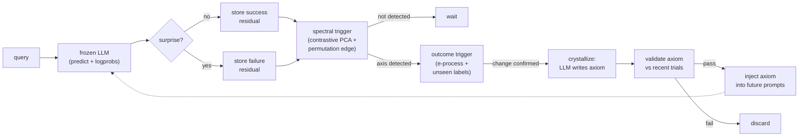

# Eigen-Memory: compressing an agent's surprises into rules instead of weights

An inference-time memory layer for frozen LLMs that compresses surprising failures into
reusable English rules via spectral analysis of prediction residuals. No fine-tuning,
no gradient access — just a wrapper that watches what the model gets wrong, detects
structure in those errors, and writes itself a short rule to inject into future prompts.



Everything runs **locally**: `gemma3:4b` / `gemma4:12b` + `embeddinggemma` via Ollama,
Postgres + `pgvector`. No API keys, no cloud.

---

## The idea

Titans ([Behrouz et al. 2024](https://arxiv.org/abs/2501.00663)) showed that a memory which
decides what to keep by measuring its own surprise can beat attention at scale. But Titans
compresses into neural weights inside an architecture you pretrain from scratch. This project
takes the same idea — *surprise decides what survives* — and asks whether it works as a
pure inference-time wrapper around a model you can't touch. The bet: compress into sentences
instead of weights, and you get something auditable, portable, and cheap.

Three moving parts:

- **Surprise** is read from the model's own logits — entropy and NLL of the true label — a
  black-box analogue of Titans' gradient signal. Measured *with memory in context*, so
  already-solved items stop registering.
- **Detection** watches the residuals (query embedding minus retrieved-neighbor embedding)
  and fires when failures line up along a direction that clears a permutation-estimated noise
  edge. A separate outcome trigger catches rule-shifts from the correctness stream.
- **Crystallization** compresses that whole cluster into one English rule — an **axiom** —
  validated against recent trials before storage, retired if it stops earning its place.

The comparison throughout is against plain **RAG** — retrieving the most similar past
examples — because that is what you would actually build instead.

---

## The results

Four controlled experiments. The headline: on static tasks, rules never beat retrieval.
When the rule changes mid-run, they do — but only after the detector was rebuilt around the
right signal.

| # | Experiment | Verdict |
|---|------------|---------|
| 1 | **Number-game** — hidden arithmetic rule | tie — embeddings can't see the rule, so *no* memory helps |
| 2 | **TREC** — question-type classification | RAG wins — one retrieved example already settles it |
| 3 | **Label-flip** — purpose-built, 4 seeds | tie — the 4B model applies a rule worse than it copies |
| 4 | **Rule-Shift** — rule flips mid-run, 12B model, 5 seeds | **miss** as pre-registered (+0.078), then **met** after rebuild (+0.242) |

The static tasks are a negative result, but a *structured* one. Each experiment failed for a
specific, diagnosable reason — the embeddings can't encode the rule, or one retrieved example
already saturates performance, or the model follows a pasted rule worse than it copies a
neighbor's label. The gate stayed shut on all of them, correctly: zero false positives on
tasks with no rank-1 signal. Silence was the right answer.
([Details](docs/FINDINGS.md) and [the static-task paradox](docs/NEXT_EXPERIMENT.md).)

---

## The story

This is a project about diagnosis, not about winning.

**The pre-registered experiment missed.** Rule-Shift scored +0.078 against a +0.10 bar.
The trigger fired on 1 of 5 seeds — and on rerun, that one seed didn't fire again.

**The autopsy found four defects.** The largest: detection was watching a 768-dimensional
contrast statistic operating with no margin, while the agent's own *correctness stream*
carried the same event at far higher signal. The ungated ablation proved the signal was
there — forced to crystallize, all four shut seeds wrote correct rules. The live estimator
just couldn't surface it.

**The rebuild met the bar.** Same five seeds, same bar: **+0.242**. Detection moved to the
correctness stream (5/5 seeds detect, 0 false fires). Pre-change records dropped from the
contrast window. Axioms validated before storage, retired when stale. 3 of 5 seeds fired,
every rule correct on both branches, `request` accuracy 1.000 wherever it fired. The two
non-firing seeds wrote *nothing* rather than something wrong — they ran out of post-shift
stream before the window refilled.

**The caveat is structural.** This is an in-sample result — the v4 pipeline was iteratively
debugged and tuned on the same five seeds it reports on. The pre-registered pipeline scored
+0.078. Without held-out seeds or a second task, the generalization claim is unverified.

Along the way: five bugs that silently corrupted the signal (two made "surprise" a constant,
one flattened it for 2 of 3 classes, two injected raw chain-of-thought into the arm under
test), a theory review that disproved the project's own original mechanism and replaced it
with one where [every claim is an executable test](tests/test_kernel_theory.py), and a
one-line conclusion:

> *Compress into weights when your model is small. Compress into sentences when your model
> can read.*

Full narrative: **[docs/BLOG_POST.md](docs/BLOG_POST.md)**.
Full experiment ledger: **[docs/NEXT_EXPERIMENT.md](docs/NEXT_EXPERIMENT.md)**.

---

## Run it yourself

**Prerequisites:** Docker, [Ollama](https://ollama.com) (`localhost:11434`),
[uv](https://docs.astral.sh/uv/).

```bash
# Models (local, ~3-4 GB; gemma4 only needed for Rule-Shift)
ollama pull gemma3:4b
ollama pull embeddinggemma
ollama pull gemma4:12b          # ~8 GB, skip for experiments 1-3

# Stack
cp .env.example .env            # defaults work out of the box
docker compose up -d
docker exec -i memory-db psql -U postgres -d memory_agent < schema.sql
uv sync

# Experiments
uv run python simulate.py                    # number-game
TASK=trec uv run python simulate.py          # TREC
uv run python run_flip_experiment.py 42      # label-flip (4 arms)
uv run python run_shift_experiment.py 42     # Rule-Shift (~6h/seed on consumer GPU)

# Tests — includes the executable theory
uv run pytest
```

---

## Going deeper

| Document | What it covers |
|----------|----------------|
| [docs/BLOG_POST.md](docs/BLOG_POST.md) | Full narrative — Titans lineage, the corrected compressor, the executor gate |
| [docs/NEXT_EXPERIMENT.md](docs/NEXT_EXPERIMENT.md) | Pre-registration, the static-task paradox, Rule-Shift design, five-seed verdict, and the open roadmap |
| [docs/THEORY.md](docs/THEORY.md) | The corrected mechanism — contrastive PCA over retrieval residuals with a detectability-gated trigger; every claim executable |
| [docs/FINDINGS.md](docs/FINDINGS.md) | Number-game and TREC results, constant-surprise bug archaeology |
| [docs/PRIOR_ART.md](docs/PRIOR_ART.md) | Literature placement — Titans, RepE, cPCA, BBP, the verbal-consolidation line |

---

## Repository layout

```
src/eigen_memory_agent/
  agent.py                      # the agent loop: predict, measure surprise, learn
  memory_kernel.py              # contrastive residual PCA -> gated axiom crystallization

simulate.py                     # number-game / TREC experiment
run_flip_experiment.py          # 4-arm label-flip experiment
run_shift_experiment.py         # 5-arm Rule-Shift experiment (incl. recency kill arm)

tests/                          # 12 test files, including the executable theory
scripts/analysis/               # gate calibration, guardrails, ablations, plotting
results/                        # every number in the docs traces to a committed artifact
docs/                           # theory, task design, prior art, blog post
```

## License

[MIT](LICENSE). Datasets are downloaded at runtime — see [docs/DATASETS.md](docs/DATASETS.md).
